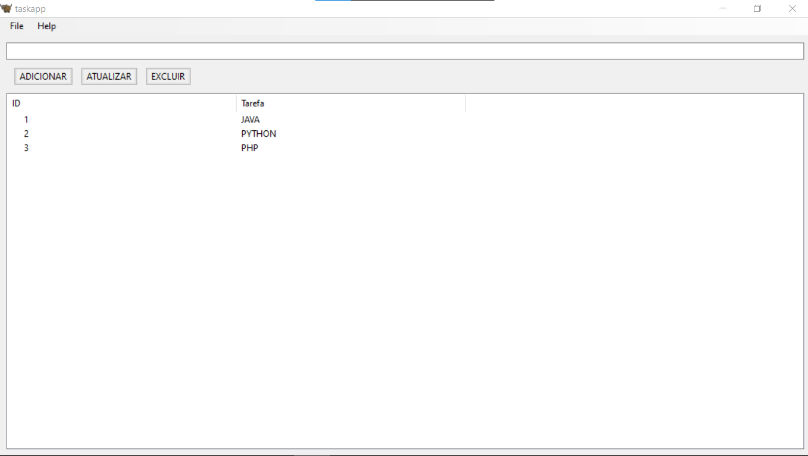
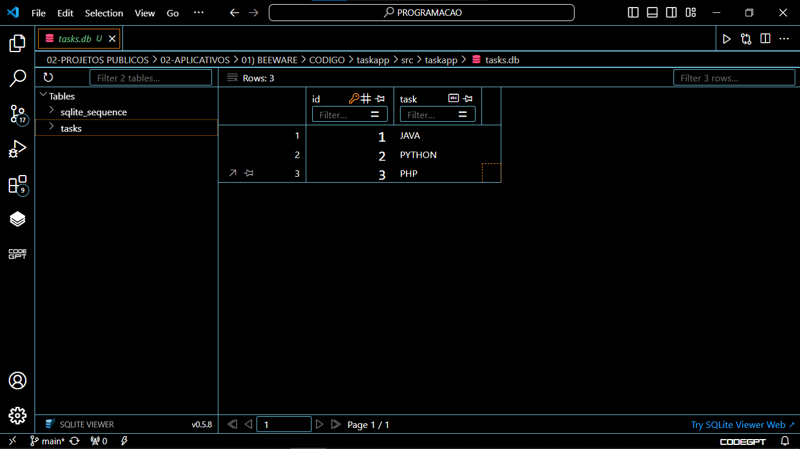

# TAREFAS COM BEEWARE
👨‍🏫SIMPLES CRUD DE LISTA DE TAREFAS COM BEEWARE E SQLITE.

 <br>
 <br>

## DESCRIÇÃO:
O aplicativo de gerenciamento de tarefas é uma aplicação simples desenvolvida utilizando a biblioteca Python `toga` e um banco de dados SQLite para armazenar e manipular tarefas. Ele oferece funcionalidades básicas de adicionar, atualizar, excluir e selecionar tarefas.

## FUNCIONALIDADES:
1. **Inicialização do Banco de Dados:**
   - Ao iniciar o aplicativo (`__main__`), o banco de dados SQLite é inicializado se ainda não existir uma tabela de tarefas.

2. **Interface do Usuário:**
   - A interface do aplicativo é construída usando componentes `toga`, como `MainWindow`, `Box`, `TextInput`, `Button` e `Table`.
   - A tela principal contém:
     - Um campo de entrada (`TextInput`) para adicionar ou editar o texto da tarefa.
     - Três botões (`Button`) para adicionar, atualizar e excluir tarefas.
     - Uma tabela (`Table`) que exibe as tarefas existentes com colunas para ID e descrição da tarefa.

3. **Funcionalidades dos Botões:**
   - **Adicionar Tarefa:**
     - Insere uma nova tarefa no banco de dados quando o botão "ADICIONAR" é pressionado.
     - Atualiza a tabela para refletir a nova lista de tarefas.
     - Limpa o campo de entrada após a adição da tarefa.

   - **Atualizar Tarefa:**
     - Atualiza a tarefa selecionada na tabela com o texto fornecido no campo de entrada quando o botão "ATUALIZAR" é pressionado.
     - Atualiza a tabela para refletir as alterações feitas.
     - Limpa o campo de entrada após a atualização da tarefa.

   - **Excluir Tarefa:**
     - Remove a tarefa selecionada na tabela quando o botão "EXCLUIR" é pressionado.
     - Atualiza a tabela para refletir as alterações feitas.

4. **Seleção de Tarefa na Tabela:**
   - Quando o usuário seleciona uma tarefa na tabela, o texto da tarefa é exibido no campo de entrada.
   - O ID da tarefa selecionada é exibido no console para fins de debug (pode ser removido em uma versão final).

## EXECUTANDO O PROJETO:
1. **Instalação:**
   - Entre no diretório `./CODIGO/taskapp` e execute o comando:

   ```bash
   pip install -r requirements.txt
   ```

2. **Executando o Aplicativo:**
   - Execute o aplicativo em modo de desenvolvimento utilizando o Briefcase:
     ```
     briefcase dev
     ```

3. **Interagindo com o Aplicativo:**
   - Na interface do aplicativo, você verá um campo de texto onde pode digitar uma nova tarefa.
   - Use o botão "ADICIONAR" para inserir uma nova tarefa na lista.
   - Selecione uma tarefa na tabela para atualizar ou excluir utilizando os botões "ATUALIZAR" ou "EXCLUIR", respectivamente.
   - O texto da tarefa selecionada será exibido no campo de texto para edição.
   - As operações de adicionar, atualizar e excluir são refletidas dinamicamente na tabela.

## NÃO SABE?
- Entendemos que para manipular arquivos em muitas linguagens, é necessário possuir conhecimento nessas áreas. Para auxiliar nesse aprendizado, oferecemos cursos gratuitos disponíveis:
* [CURSO DE PYTHON](https://github.com/VILHALVA/CURSO-DE-PYTHON)
* [CURSO DE BEEWARE](https://github.com/VILHALVA/CURSO-DE-BEEWARE)
* [CURSO DE SQLITE](https://github.com/VILHALVA/CURSO-DE-SQLITE)
* [CURSO DE PYTHON COM SQLITE](https://github.com/VILHALVA/CURSO-DE-PYTHON-COM-SQLITE)
* [CONFIRA MAIS CURSOS](https://github.com/VILHALVA?tab=repositories&q=+topic:CURSO)

## CREDITOS:
- [PROJETO CRIADO PELO VILHALVA](https://github.com/VILHALVA)


